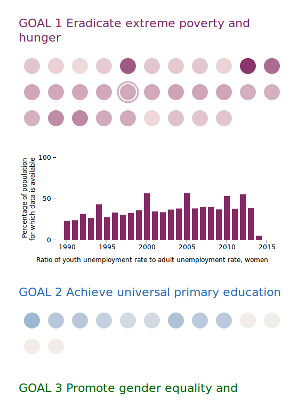

This repository contains a visualization of the metadata behind the UN Millennium  Goal Development report. 

 

It answers question such as "How much data is behind the MGD report?", "How many people does it represent?". Users can explore how much data has been collected about each of the millennium goals. They can learn how much of Earth's 
population is represented in each of data points collected and see for which goals the UN is making progress in collecting more data in recent years. 

The visualization can be a companion when reading the report or looking at other visualizations. It can be used to 
investigate if results presented are grounded on a sound basis of data.

This project was submitted to the World Statistics Day 2015 
[data visualization challenge](https://unite.un.org/ideas/content/wsd2015-data-visualization-challenge) by the UN.

A live version can be found at [http://un.krasch.io](http://un.krasch.io)
